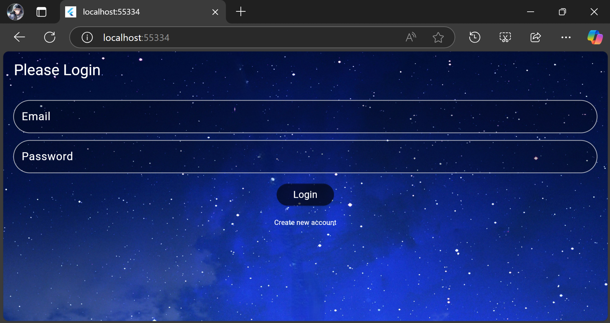

# Sample Login Page

This is a simple login page UI built using Flutter.  
It was created as a practice project to learn and explore Flutter widgets.

---

## 🛠️ Techniques & Widgets Used

- `TextField` for user inputs
- `Image.asset` for adding a background image
- `AlertDialog` to show a pop-up message ("Login Successful")
- `TextButton`, `ElevatedButton`, and `IconButton` for interactive buttons
- `Stack` for overlapping layouts (placing text fields over the background image)
- `Row` & `Column` for arranging UI elements
- `SingleChildScrollView` for scrollable content
- `Expanded` for flexible space distribution

---

## 📝 Key Learnings

1. A `TextField` by default takes up all the available horizontal space in a `Row`. To use it alongside other widgets in the same `Row`, wrap the `TextField` with `Expanded` to control its size properly.

2. Use `SingleChildScrollView` to make content scrollable when it might overflow the screen, preventing content from being cut off and improving the user experience on smaller screens or web pages.

---

## 📷 Project Demo Video

> ⚡ Click the image above to watch the video on LinkedIn!

